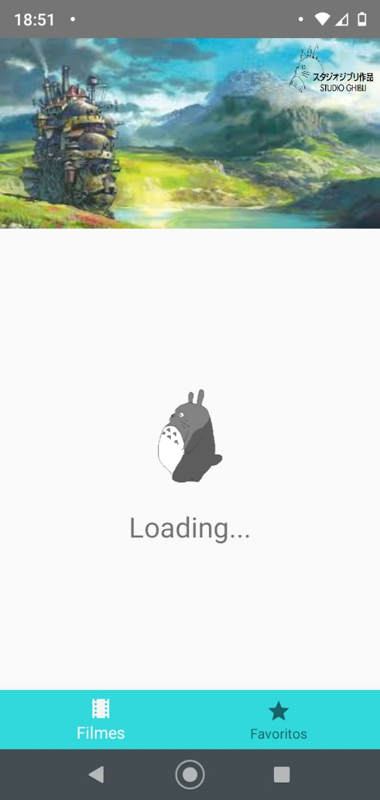
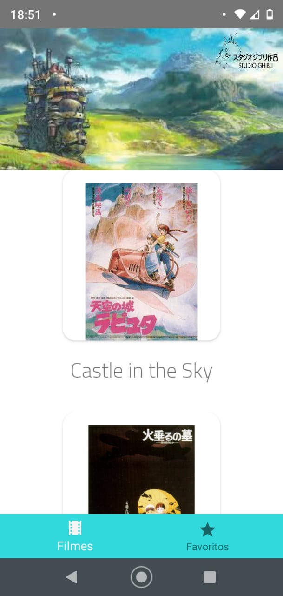

<h1 align="center">
  
   
  Android Api Estudio Ghibli
</h1>

<h4 align="center">
  Aplicativo densenvolvido no padrão MVP

## Sobre
Em desenvolvimeto...

## Projeto
Desenvolvido com as tecnologias mais recentes no desenvolvimento de aplicações Android, utlizando a arquitetura MVVM, injenção de dependências e android architecture.

## Tecnologias

-  [Kotlin](https://kotlinlang.org/)
-  [Retrofit](https://square.github.io/retrofit/)

## Imagens

  
  
  

